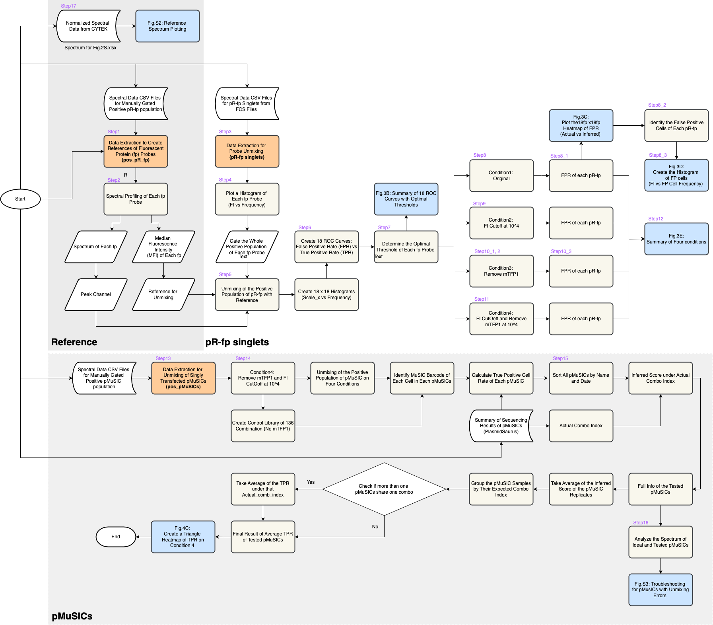

## **Installation**
For specific Python packages, a requirements file has been provided at 'requirements.txt'.
Assuming Pythonis installed, run the following command to install all necessary dependencies:
```
pip install -r requirements.txt
```
## **Usage**
All original files and the result files were available upon request due to size limitations.

To use the project, you can use the run_all.py file in the terminal using

```
python run_all.py
```
## Code Flow


