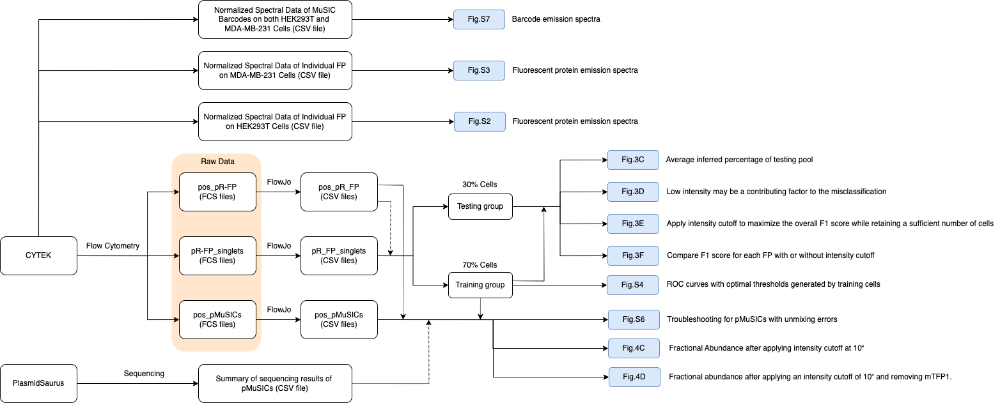

## **Installation**
For specific Python packages, a requirements file has been provided at 'requirements.txt'.
Assuming Python is installed, run the following command to install all necessary dependencies:
```
pip install -r requirements.txt
```

## **Usage**
All result files were available upon request due to size limitations. 
To use the project, navigate to the ```src``` folder and run the ```run_all.py``` file in the terminal by executing the following commands:
```
cd src/
python run_all.py
```
### **Structure Tree**
The structure tree below displays the original data and the corresponding resulting figures.



### Code Flow
Data analysis was carried out according to the code flow outlined below:


